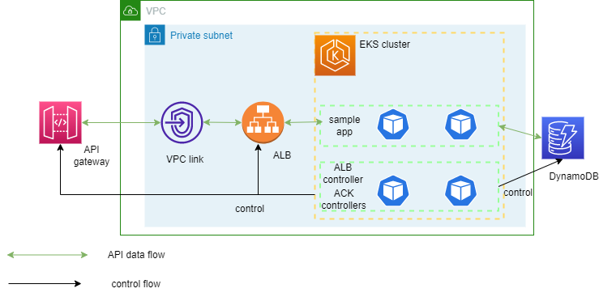

# Complete Example

Configuration in this directory creates an AWS EKS cluster with the following ACK addons:

- Amazon ACM Controller
- Amazon ApiGatewayV2 Controller
- Amazon DynamoDB Controller
- Amazon EC2 Controller
- Amazon EKS Controller
- Amazon ElastiCache Controller
- Amazon EMR Containers Controller
- Amazon EventBridge Controller
- Amazon IAM Controller
- Amazon KMS Controller
- AWS Lambda Controller
- Amazon Prometheus Service Controller
- Amazon RDS Controller
- Amazon S3 Controller
- AWS SFN Controller
- Amazon SNS Controller
- Amazon SQS Controller

In addition, this example provisions a sample application which demonstrates using the ACK controllers for resource provisioning.
The arhchitecture looks like this: <br>


## Prerequisites:

Ensure that you have the following tools installed locally:

1. [aws cli](https://docs.aws.amazon.com/cli/latest/userguide/install-cliv2.html)
2. [kubectl](https://Kubernetes.io/docs/tasks/tools/)
3. [terraform](https://learn.hashicorp.com/tutorials/terraform/install-cli)

## Deploy

To provision this example:

```sh
terraform init
terraform apply -var aws_region=<aws_region> # defaults to us-west-2
```

Enter `yes` at command prompt to apply

## Validate

The following command will update the `kubeconfig` on your local machine and allow you to interact with your EKS Cluster using `kubectl` to validate the CoreDNS deployment for Fargate.

1. Run `update-kubeconfig` command:

```sh
aws eks --region <REGION> update-kubeconfig --name <CLUSTER_NAME>
```

2. Verify ACK controllers for the services that are enabled are running:

```sh
kubectl get pods -A

NAMESPACE     NAME                                            READY   STATUS    RESTARTS   AGE
ack-system    ack-acm-5ffccbd5d5-62kx9                        1/1     Running   0          11m
ack-system    ack-apigatewayv2-cf6cd9d67-vxhsk                1/1     Running   0          11m
ack-system    ack-dynamodb-bd47f88b7-7jbgw                    1/1     Running   0          10m
ack-system    ack-ec2-54dfcf968-pdbs2                         1/1     Running   0          10m
ack-system    ack-eks-9cb44fc-95k6x                           1/1     Running   0          11m
ack-system    ack-elasticache-5758ff66bd-6vbgc                1/1     Running   0          11m
ack-system    ack-emrcontainers-69ffb54758-78ksb              1/1     Running   0          11m
ack-system    ack-eventbridge-58c7d4c8f5-vvfz5                1/1     Running   0          11m
ack-system    ack-iam-7486c996c8-kbb2h                        1/1     Running   0          11m
ack-system    ack-kms-bb956b4fc-x69lv                         1/1     Running   0          11m
ack-system    ack-lambda-65bd7fbc8d-6jn8k                     1/1     Running   0          11m
ack-system    ack-prometheusservice-5bccddc6f-7tkl5           1/1     Running   0          11m
ack-system    ack-rds-57499b447d-pg9tq                        1/1     Running   0          10m
ack-system    ack-s3-78b44bf586-b8qnj                         1/1     Running   0          11m
ack-system    ack-sfn-7494cbccf-vx6g7                         1/1     Running   0          10m
ack-system    ack-sns-56bb579874-h26s5                        1/1     Running   0          11m
ack-system    ack-sqs-5f7bc84d45-47zw4                        1/1     Running   0          11m
kube-system   aws-load-balancer-controller-84b5bf9c5f-45fkt   1/1     Running   0          10m
kube-system   aws-load-balancer-controller-84b5bf9c5f-vtwj4   1/1     Running   0          10m
kube-system   aws-node-btph9                                  2/2     Running   0          10m
kube-system   aws-node-dqh67                                  2/2     Running   0          10m
kube-system   aws-node-kt5mp                                  2/2     Running   0          10m
kube-system   coredns-787cb67946-hlqfm                        1/1     Running   0          14m
kube-system   coredns-787cb67946-q8lzj                        1/1     Running   0          14m
kube-system   eks-pod-identity-agent-lhj4d                    1/1     Running   0          10m
kube-system   eks-pod-identity-agent-vvf46                    1/1     Running   0          10m
kube-system   eks-pod-identity-agent-zw2qv                    1/1     Running   0          10m
kube-system   kube-proxy-27k5q                                1/1     Running   0          10m
kube-system   kube-proxy-6q78s                                1/1     Running   0          10m
kube-system   kube-proxy-x5hhm                                1/1     Running   0          10m
kube-system   metrics-server-7577444cf8-9l7h8                 1/1     Running   0          12m
```

## Sample Application Deployment

1. Update `sample-app/app.yaml` file and deploy:

```yaml
apiVersion: apps/v1
kind: Deployment
metadata:
  name: deploy-api-dynamodb
  namespace: ack-demo
    ... <Truncated for brevity>
    env:
    - name: tableName     # match with your dynamodb table setting
        value: ack-demo-table
    - name: aws_region
        value: "<same region as your eks cluster>"
```

```sh
kubectl apply -f sample-app/app.yaml
```

Note: app.yaml deploys a simple nodeJS image from docker hub. The source code can be found [here](https://github.com/season1946/ack-microservices/tree/main/sample-app-code)

2. Get the listener ARN of the provisioned ALB:

```sh
aws elbv2 describe-listeners \
  --region <aws_region> \
  --load-balancer-arn $(aws elbv2 describe-load-balancers \
  --region <aws_region> \
  --query "LoadBalancers[?contains(DNSName, '$(kubectl get ingress ingress-api-dynamodb -n ack-demo -o=jsonpath="{.status.loadBalancer.ingress[].hostname}")')].LoadBalancerArn" \
  --output text) \
  --query "Listeners[0].ListenerArn" \
  --output text
```

> Replace `<aws_region>` in the command above with the correspoding region you deployed the cluster

3. Update `sample-app/apigwv2-httpapi.yaml` file and deploy:

```yaml
apiVersion: apigatewayv2.services.k8s.aws/v1alpha1
kind: Integration
metadata:
  name: 'vpc-integration'
spec:
  apiRef:
    from:
      name: 'ack-api'
  integrationType: HTTP_PROXY
  integrationURI: '<your ALB listener arn>'
  integrationMethod: ANY
  payloadFormatVersion: '1.0'
  connectionID: '<your vpclink id>' # api_gatewayv2_vpc_link_id in Terraform output
  connectionType: 'VPC_LINK'
```

```sh
kubectl apply -f sample-app/apigwv2-httpapi.yaml
```

Verify the status
```sh
echo API=$(kubectl get api.apigatewayv2.services.k8s.aws/ack-api -o jsonpath='{.status.conditions[?(@.type=="ACK.ResourceSynced")].status}')
echo Stage=$(kubectl get stage.apigatewayv2.services.k8s.aws/default-stage -o jsonpath='{.status.conditions[?(@.type=="ACK.ResourceSynced")].status}')
echo Route=$(kubectl get route.apigatewayv2.services.k8s.aws/ack-route-vpclink -o jsonpath='{.status.conditions[?(@.type=="ACK.ResourceSynced")].status}')
echo Integration=$(kubectl get integration.apigatewayv2.services.k8s.aws/vpc-integration -o jsonpath='{.status.conditions[?(@.type=="ACK.ResourceSynced")].status}')
```

Expected output
```
API=True
Stage=True
Route=True
Integration=True
```

4. Deploy DynamoDB table

```sh
kubectl apply -f sample-app/dynamodb-table.yaml
```

Verify the status
```sh
echo DynamoDB=$(kubectl get table.dynamodb.services.k8s.aws/ack-demo -o jsonpath='{.status.conditions[?(@.type=="ACK.ResourceSynced")].status}')
```

Expected output
```
DynamoDB=True
```

5. Test the API created. Get the api domain:

```sh
kubectl get -n ack-demo api ack-api -o jsonpath="{.status.apiEndpoint}"
```

6. Post data to dynamodb with `post` and query data with `get`

```
curl -X POST \
 -H 'Content-Type: application/json' \
 -d '{ "name": "external" }' \
 $(kubectl get -n ack-demo api ack-api -o jsonpath="{.status.apiEndpoint}")/rows/add

curl $(kubectl get -n ack-demo api ack-api -o jsonpath="{.status.apiEndpoint}")/rows/all
```

## Destroy

To teardown and remove the resources created in this example:

```sh
kubectl delete -f sample-app

terraform destroy -target="module.eks_ack_addons" -target="module.eks_blueprints_kubernetes_addons" -auto-approve
terraform destroy -target="module.eks_blueprints" -auto-approve
terraform destroy -auto-approve
```
