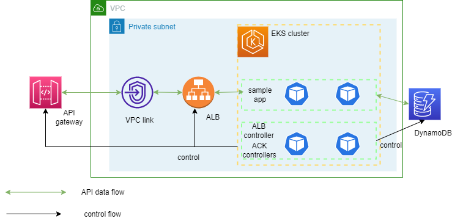

# Complete Example

Configuration in this directory creates an AWS EKS cluster with the following ACK addons:
- Amazon Network Firewall
- Amazon CloudWatch Logs
- Amazon Kinesis
- AWS Secrets Manager
- Amazon Route53Resolver
- Amazon Route 53
- Amazon Organizations
- Amazon MQ
- Amazon CloudWatch
- Amazon Keyspaces
- Amazon Kafka
- Amazon EFS
- Amazon ECS
- Amazon CloudTrail
- Amazon CloudFront
- Amazon Application Auto Scaling
- Amazon ACM Controller
- Amazon ApiGatewayV2 Controller
- Amazon DynamoDB Controller
- Amazon EC2 Controller
- Amazon ECR Controller
- Amazon EKS Controller
- Amazon ElastiCache Controller
- Amazon EMR Containers Controller
- Amazon EventBridge Controller
- Amazon IAM Controller
- Amazon KMS Controller
- AWS Lambda Controller
- Amazon MemoryDB Controller
- Amazon OpenSearch Service Controller
- Amazon Prometheus Service Controller
- Amazon RDS Controller
- Amazon S3 Controller
- Amazon SageMaker Controller
- AWS SFN Controller
- Amazon SNS Controller
- Amazon SQS Controller

In addition, this example provisions a sample application which demonstrates using the ACK controllers for resource provisioning.
The arhchitecture looks like this: <br>


## Prerequisites:

Ensure that you have the following tools installed locally:

1. [aws cli](https://docs.aws.amazon.com/cli/latest/userguide/install-cliv2.html)
2. [kubectl](https://Kubernetes.io/docs/tasks/tools/)
3. [terraform](https://learn.hashicorp.com/tutorials/terraform/install-cli)

## Deploy

To provision this example:

```sh
terraform init
terraform apply -var aws_region=<aws_region> # defaults to us-west-2
```

Enter `yes` at command prompt to apply

## Validate

The following command will update the `kubeconfig` on your local machine and allow you to interact with your EKS Cluster using `kubectl` to validate the CoreDNS deployment for Fargate.

1. Run `update-kubeconfig` command:

```sh
aws eks --region <REGION> update-kubeconfig --name <CLUSTER_NAME>
```

2. Verify ACK controllers for the services that are enabled are running:

```sh
kubectl get pods -A

NAMESPACE     NAME                                            READY   STATUS    RESTARTS   AGE
ack-system    ack-acm-5697f4c5b4-czd5b                        1/1     Running   0          11m
ack-system    ack-apigatewayv2-76d6bbd788-77t8p               1/1     Running   0          10m
ack-system    ack-applicationautoscaling-5fd6c8bf8f-zqn4p     1/1     Running   0          11m
ack-system    ack-cloudfront-544f4887c4-jhw5b                 1/1     Running   0          12m
ack-system    ack-cloudtrail-5dc78b7576-2bwds                 1/1     Running   0          11m
ack-system    ack-cloudwatch-5b844f47db-6fb5d                 1/1     Running   0          11m
ack-system    ack-cloudwatchlogs-757f9879fb-jtvhh             1/1     Running   0          11m
ack-system    ack-dynamodb-7f4b47488d-btjff                   1/1     Running   0          12m
ack-system    ack-ec2-5fbf6f55d9-hn8jw                        1/1     Running   0          11m
ack-system    ack-ecr-5b4699f87b-rt5xt                        1/1     Running   0          11m
ack-system    ack-ecs-74d8d67695-zbv97                        1/1     Running   0          10m
ack-system    ack-efs-7b9f965b96-qbc6q                        1/1     Running   0          13m
ack-system    ack-eks-54945d94d4-mflgw                        1/1     Running   0          12m
ack-system    ack-elasticache-5758ff66bd-mmj27                1/1     Running   0          12m
ack-system    ack-emrcontainers-74c5d7b8c-9htg9               1/1     Running   0          11m
ack-system    ack-eventbridge-b76bd85b8-dtvxr                 1/1     Running   0          13m
ack-system    ack-iam-89dd5d6b5-wf8tm                         1/1     Running   0          11m
ack-system    ack-kafka-7bd95bd59-dvcf6                       1/1     Running   0          10m
ack-system    ack-keyspaces-6cc9bbc575-lfjwr                  1/1     Running   0          11m
ack-system    ack-kinesis-687bf76869-kqshn                    1/1     Running   0          11m
ack-system    ack-kms-58b89848db-hrf8v                        1/1     Running   0          11m
ack-system    ack-lambda-65bd7fbc8d-fjqfj                     1/1     Running   0          11m
ack-system    ack-memorydb-76c988f6dd-4v8cz                   1/1     Running   0          10m
ack-system    ack-mq-85b69db6c-tlt2p                          1/1     Running   0          11m
ack-system    ack-networkfirewall-c6676fddc-tlvzr             1/1     Running   0          12m
ack-system    ack-opensearchservice-7fd9d8c866-9kkdx          1/1     Running   0          11m
ack-system    ack-organizations-784c69d659-cpn2r              1/1     Running   0          13m
ack-system    ack-prometheusservice-6d657cd878-7h7jw          1/1     Running   0          12m
ack-system    ack-rds-7df84bf989-hh7z7                        1/1     Running   0          12m
ack-system    ack-route53-5d45dcbf66-9f82r                    1/1     Running   0          12m
ack-system    ack-route53resolver-696cf68868-k825q            1/1     Running   0          12m
ack-system    ack-s3-6ffc4698c6-jtv6k                         1/1     Running   0          12m
ack-system    ack-sagemaker-74f65d4cb9-g9ngl                  1/1     Running   0          12m
ack-system    ack-secretsmanager-7974695c58-xkgbx             1/1     Running   0          13m
ack-system    ack-sfn-6b875794cb-c7pcv                        1/1     Running   0          11m
ack-system    ack-sns-5c75794dbc-v5fgb                        1/1     Running   0          11m
ack-system    ack-sqs-55dfc46cd6-wtz7d                        1/1     Running   0          13m
kube-system   aws-load-balancer-controller-84b5bf9c5f-cd2kn   1/1     Running   0          12m
kube-system   aws-load-balancer-controller-84b5bf9c5f-z5mkm   1/1     Running   0          12m
kube-system   aws-node-5lv6j                                  2/2     Running   0          11m
kube-system   aws-node-c8ncz                                  2/2     Running   0          11m
kube-system   aws-node-d4tcw                                  2/2     Running   0          10m
kube-system   coredns-787cb67946-82m2k                        1/1     Running   0          16m
kube-system   coredns-787cb67946-kf4vn                        1/1     Running   0          16m
kube-system   eks-pod-identity-agent-cnklq                    1/1     Running   0          11m
kube-system   eks-pod-identity-agent-fdjvk                    1/1     Running   0          11m
kube-system   eks-pod-identity-agent-jzzsb                    1/1     Running   0          11m
kube-system   kube-proxy-9x5js                                1/1     Running   0          12m
kube-system   kube-proxy-f4hk9                                1/1     Running   0          12m
kube-system   kube-proxy-gxcxt                                1/1     Running   0          12m
kube-system   metrics-server-7577444cf8-mhx97                 1/1     Running   0          14m
```

## Sample Application Deployment

1. Update `sample-app/app.yaml` file and deploy:

```yaml
apiVersion: apps/v1
kind: Deployment
metadata:
  name: deploy-api-dynamodb
  namespace: ack-demo
    ... <Truncated for brevity>
    env:
    - name: tableName     # match with your dynamodb table setting
        value: ack-demo-table
    - name: aws_region
        value: "<same region as your eks cluster>"
```

```sh
kubectl apply -f sample-app/app.yaml
```

Note: app.yaml deploys a simple nodeJS image from docker hub. The source code can be found [here](https://github.com/season1946/ack-microservices/tree/main/sample-app-code)

2. Get the listener ARN of the provisioned ALB:

```sh
aws elbv2 describe-listeners \
  --region <aws_region> \
  --load-balancer-arn $(aws elbv2 describe-load-balancers \
  --region <aws_region> \
  --query "LoadBalancers[?contains(DNSName, '$(kubectl get ingress ingress-api-dynamodb -n ack-demo -o=jsonpath="{.status.loadBalancer.ingress[].hostname}")')].LoadBalancerArn" \
  --output text) \
  --query "Listeners[0].ListenerArn" \
  --output text
```

> Replace `<aws_region>` in the command above with the correspoding region you deployed the cluster

3. Update `sample-app/apigwv2-httpapi.yaml` file and deploy:

```yaml
apiVersion: apigatewayv2.services.k8s.aws/v1alpha1
kind: Integration
metadata:
  name: 'vpc-integration'
spec:
  apiRef:
    from:
      name: 'ack-api'
  integrationType: HTTP_PROXY
  integrationURI: '<your ALB listener arn>'
  integrationMethod: ANY
  payloadFormatVersion: '1.0'
  connectionID: '<your vpclink id>' # api_gatewayv2_vpc_link_id in Terraform output
  connectionType: 'VPC_LINK'
```

```sh
kubectl apply -f sample-app/apigwv2-httpapi.yaml
```

Verify the status
```sh
echo API=$(kubectl get api.apigatewayv2.services.k8s.aws/ack-api -o jsonpath='{.status.conditions[?(@.type=="ACK.ResourceSynced")].status}')
echo Stage=$(kubectl get stage.apigatewayv2.services.k8s.aws/default-stage -o jsonpath='{.status.conditions[?(@.type=="ACK.ResourceSynced")].status}')
echo Route=$(kubectl get route.apigatewayv2.services.k8s.aws/ack-route-vpclink -o jsonpath='{.status.conditions[?(@.type=="ACK.ResourceSynced")].status}')
echo Integration=$(kubectl get integration.apigatewayv2.services.k8s.aws/vpc-integration -o jsonpath='{.status.conditions[?(@.type=="ACK.ResourceSynced")].status}')
```

Expected output
```
API=True
Stage=True
Route=True
Integration=True
```

4. Deploy DynamoDB table

```sh
kubectl apply -f sample-app/dynamodb-table.yaml
```

Verify the status
```sh
echo DynamoDB=$(kubectl get table.dynamodb.services.k8s.aws/ack-demo -o jsonpath='{.status.conditions[?(@.type=="ACK.ResourceSynced")].status}')
```

Expected output
```
DynamoDB=True
```

5. Test the API created. Get the api domain:

```sh
kubectl get -n ack-demo api ack-api -o jsonpath="{.status.apiEndpoint}"
```

6. Post data to dynamodb with `post` and query data with `get`

```
curl -X POST \
 -H 'Content-Type: application/json' \
 -d '{ "name": "external" }' \
 $(kubectl get -n ack-demo api ack-api -o jsonpath="{.status.apiEndpoint}")/rows/add

curl $(kubectl get -n ack-demo api ack-api -o jsonpath="{.status.apiEndpoint}")/rows/all
```

## Destroy

To teardown and remove the resources created in this example:

```sh
kubectl delete -f sample-app

terraform destroy -target="module.eks_ack_addons" -target="module.eks_blueprints_kubernetes_addons" -auto-approve
terraform destroy -target="module.eks_blueprints" -auto-approve
terraform destroy -auto-approve
```
